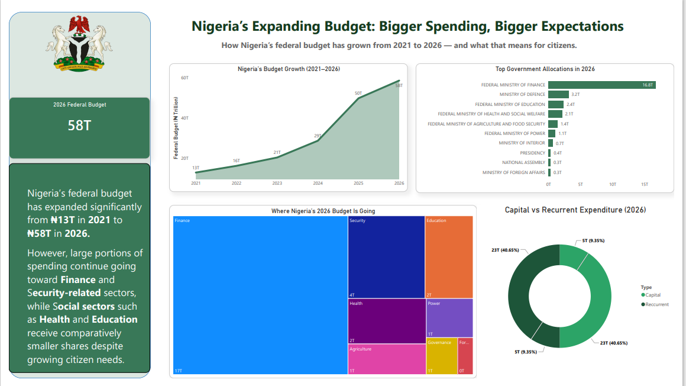
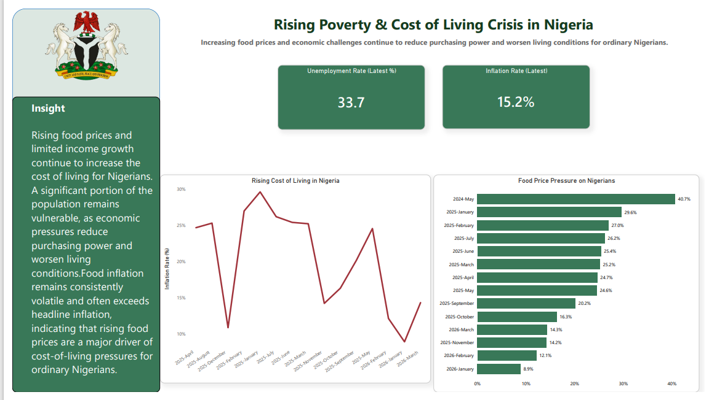

# Nigeria's 2026 Budget: What It Means for Citizens

## Project Overview

This project explores Nigeria's 2026 Federal Budget through a citizen-centered lens. Rather than focusing solely on budget figures, the analysis investigates how government spending decisions may affect the daily lives of ordinary Nigerians.

Using data from the Budget Office of the Federation, National Bureau of Statistics (NBS), Debt Management Office (DMO), and World Bank, this project examines budget growth, debt obligations, revenue sustainability, inflation, unemployment, and overall citizen impact.

---

## Dashboard Walkthrough

Watch the interactive dashboard walkthrough here:

[Dashboard Video](https://youtu.be/AOlv-g8cl5w)

---

## Dashboard Preview

### Executive Overview

### Debt Before Development

### Inflation & Cost of Living.

### Citizen Impact

---

## Problem Statement

Nigeria's federal budget has grown significantly over the years. However, an important question remains:

**Are citizens experiencing the benefits of increased government spending?**

This project seeks to answer that question through data-driven analysis and storytelling.

---

## Objectives

* Analyze Nigeria's budget growth from 2021–2026
* Examine the impact of debt servicing on development spending
* Compare capital and recurrent expenditure
* Assess the sustainability of government spending against projected revenue
* Investigate the impact of inflation and unemployment on citizens
* Translate complex budget data into actionable insights

---

## Data Sources

* Budget Office of the Federation
* National Bureau of Statistics (NBS)
* Debt Management Office (DMO)
* World Bank Open Data

---

## Tools Used

* Power BI
* Microsoft Excel
* Power Query
* Data Storytelling Techniques

---

## Key Insights

### Budget Growth

Nigeria's federal budget increased from approximately ₦13 trillion in 2021 to ₦58 trillion in 2026.

### Debt Burden

A significant portion of government resources continues to be allocated to debt servicing, reducing funds available for development projects.

### Capital vs Recurrent Spending

Recurrent expenditure remains a major component of spending, limiting investments in infrastructure and long-term development.

### Revenue Sustainability

Government spending continues to exceed projected revenue, increasing dependence on borrowing.

### Inflation Impact

Rising inflation and food prices continue to erode household purchasing power.

### Citizen Impact

Despite increased spending, many Nigerians continue to face economic pressures related to unemployment, rising living costs, and limited access to quality public services.

---

## Dashboard Pages

### Executive Overview

Provides a high-level view of budget growth and allocation priorities.

### Debt Before Development

Examines debt servicing obligations and fiscal sustainability.

### Capital vs Recurrent Spending

Analyzes how government resources are distributed between development and operational costs.

### Revenue vs Spending

Evaluates the gap between projected revenue and expenditure.

### Inflation and Cost of Living

Explores how inflation affects citizens despite increased government spending.

### Citizen Impact

Highlights the real-world implications of economic pressures on Nigerian households.

---

## Conclusion

The analysis reveals that while Nigeria's budget continues to grow, significant challenges remain. High debt servicing costs, inflationary pressures, and limited development spending reduce the extent to which citizens benefit from increased government expenditure.

Without deliberate policy interventions and efficient resource allocation, higher spending may not translate into improved living conditions for ordinary Nigerians.

---

## Author

Abigail Alabi

Data Analyst | Data Storyteller | Power BI Enthusiast

Connect with me on LinkedIn and follow my journey as I transform data into meaningful insights.
